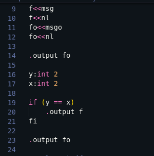

<br/>
<p align="center">
  <a href="https://github.com/HUSKI3/Wyr">
    
  </a>

  <h3 align="center">Wyr</h3>

  <p align="center">
    A simple intermediate language compiling to NASM
    <br/>
    <br/>
    <a href="https://github.com/HUSKI3/Wyr"><strong>Explore the docs »</strong></a>
    <br/>
    <br/>
    <a href="https://github.com/HUSKI3/Wyr">View Demo</a>
    .
    <a href="https://github.com/HUSKI3/Wyr/issues">Report Bug</a>
    .
    <a href="https://github.com/HUSKI3/Wyr/issues">Request Feature</a>
  </p>
</p>

    

## About The Project



Wyr is a simple language that translates *.wyr files into NASM code. It's a hobby project and is for me to learn NASM, so if any issues arise please create an issue with details. 

Why Wyr?
- Wyr is simple
- Wyr is clean
- Wyr *usually* works

Why NOT Wyr?
- Wyr is currently not finished, and only implements really basic functionality
- Wyr doesn't use a proper lexer for token gen

## Built With

This project uses pure V lang

* [V lang](https://vlang.io/)

## Getting Started

Getting started with wyr is easy.

### Prerequisites

First you'll need to install vlang itself

* vlang

```sh
wget https://github.com/vlang/v/releases/latest/download/v_linux.zip
unzip v_linux.zip
cd v
sudo ./v symlink
```

* NASM & LD
```sh
sudo apt install nasm ld
```

### Installation

To install wyr, just clone the repo. From there you can try an example
```sh
git clone git@github.com:HUSKI3/Wyr.git
cd Wyr
./build.sh examples/name.wyr
```

## Roadmap

See the [open issues](https://github.com/HUSKI3/Wyr/issues) for a list of proposed features (and known issues).

## Contributing

Contributions are what make the open source community such an amazing place to be learn, inspire, and create. Any contributions you make are **greatly appreciated**.
* If you have suggestions for adding or removing projects, feel free to [open an issue](https://github.com/HUSKI3/Wyr/issues/new) to discuss it, or directly create a pull request after you edit the *README.md* file with necessary changes.
* Please make sure you check your spelling and grammar.
* Create individual PR for each suggestion.
* Please also read through the [Code Of Conduct](https://github.com/HUSKI3/Wyr/blob/main/CODE_OF_CONDUCT.md) before posting your first idea as well.

### Creating A Pull Request

1. Fork the Project
2. Create your Feature Branch (`git checkout -b feature/AmazingFeature`)
3. Commit your Changes (`git commit -m 'Add some AmazingFeature'`)
4. Push to the Branch (`git push origin feature/AmazingFeature`)
5. Open a Pull Request

## Authors

* **Artur Z** - *NASM noob* - [Artur Z](https://github.com/HUSKI3/) - *Building Wyr*

## Acknowledgements

* [Liuk](https://github.com/liuk7071/)
* [ImgShields](https://shields.io/)
